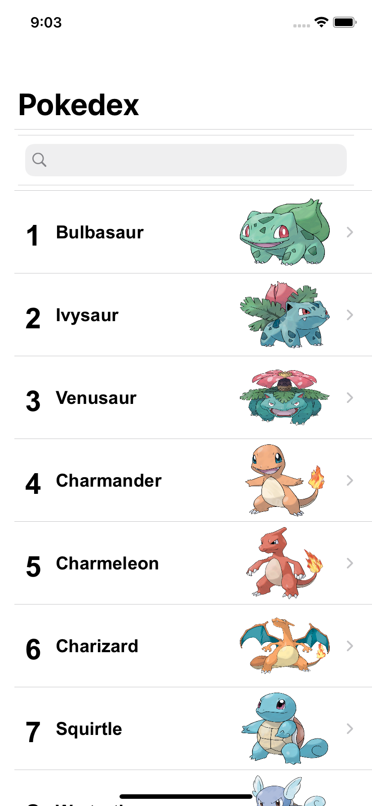

# Challenge_iOS_B2W

     
Projeto feito como desafio iOS para o processo seletivo da B2W. Os dados foram
extraídos da [PokéAPI V2](https://pokeapi.co/docs/v2.html), as imagens defaults 
dos pokemons foram consumidas deste [gerador de imagens](https://pokeres.bastionbot.org/images/pokemon/1.png)
e a imagem da logo deste app foi encontrada no [icons8](https://icons8.com.br/icon/16460/pokedex).

Este projeto possui as seguintes requisitos funcionais:
* **Tela de home**
  Tela inicial com lista com todos os Pokémons.
  Busca por ID ou Nome. 
  Paginação com endless scrolling.
  Foto default do Pokémon na listagem.

* **Tela de detalhes**
  Nome e ID;
  Carrossel com as fotos disponíveis do Pokémon;
  View com os stats do Pokémon (hp, attack, defense, special attack, special
defense, speed);
  Exibir suas Habilidades (Run Away, Adaptability, Synchronize etc);
  Ao tocar em uma habilidade, exibir um modal com a descrição;
  Exibir seus tipos (electric, ground, water, fire etc);
  Ao tocar em um tipo, exibir a lista dos Pokémons desse mesmo tipo; (apenas exibição)
  Exibir a cadeia de evolução do Pokémon; (apenas exibição)
  Exibir um picker que permita selecionar as variações do Pokémon (ao
selecionar uma variação, o app deve carregar automaticamente os dados da variação selecionada).
     
* **Imagens do projeto**     

  
  
  

